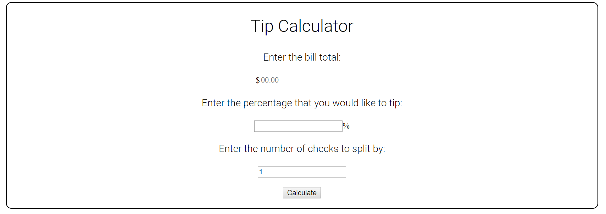

# Tip-Calculator
Submission for 2019 Summer CS Coding Challenge: Tip Calculator

### Requirements:
Create a simple command-line (Node, Python, or other) or front-end JavaScript application that will help calculate a tip at a restaurant for your server. No boilerplate code will be provided. Your application must:
 * Take in the value of the bill
 * Take in desired tip percentage
 * Include the option to split the tip amount by number of people at the table
 * The application should then calculate the amount of tip per table (or per person if the split option is  chosen) and return that value to the user

